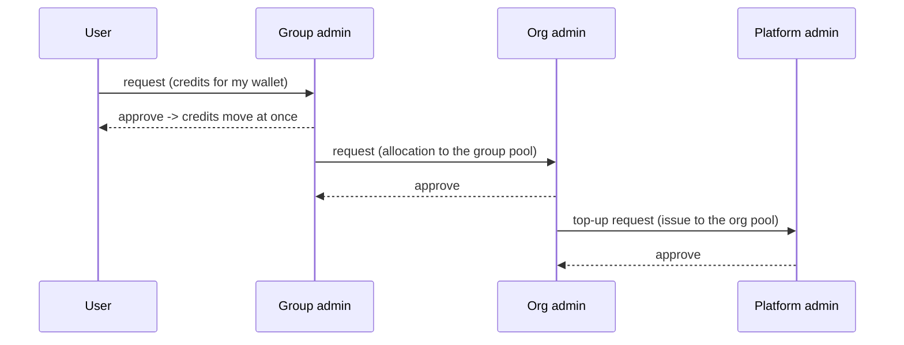

# Credit requests

Funding is pulled, not only pushed: whoever runs short asks the level above. **Credits →
Requests** is both your inbox and your own request form.

Each arrow is one level. A user never asks the platform administrator directly, and an
approval at any level moves the money immediately — there is no second confirmation step.

## The inbox

**Incoming requests** lists what is waiting for *you*:

| Column | Meaning |
|---|---|
| **Request** | The direction — *user → group*, *group → organization*, *organization → system* |
| **Target** | Whose wallet the credits would land in |
| **Amount** | What was asked for |
| **Requester** | Who asked |
| **Reason** | Their own words. This is the whole case for the request |
| **Requested at** | When |

**Approve** moves the credits from your pool to the target wallet **immediately** and notifies
the requester; **Reject** asks for a reason, which the requester sees. Both are recorded in the
[audit log](./audit.md), and the decision cannot be taken back — a mistaken approval is undone
by reclaiming, not by un-approving.

An approval fails if your pool no longer holds the amount. Allocate to your pool first (or ask
the level above), then approve.

## Asking the level above

The card at the top of the same tab is your own request form, aimed one level up:

- a **group administrator** asks the organization for an allocation to the group pool;
- an **organization administrator** raises a **top-up request** on the organization's wallet,
  which only the platform administrator can grant;
- the **platform administrator** has no card — they issue credits themselves on the
  [allocation tab](./credits-allocate.md#as-the-platform-administrator).

## Request history

Below the inbox, **Request history** keeps every decided request with its outcome and who
decided it. Use it when someone insists they asked in March: the row, the reason and the
decision are all there.

## Resource increases are a different queue

A user who is blocked by **quota** rather than by credits raises a
[resource increase request](./resources-policies.md#quota-requests) instead. Those land in
**Resources → Policies → Requests**, not here. The rule of thumb:

| The user is blocked by | Queue |
|---|---|
| *Insufficient credits* | Credit requests (this page) |
| *Quota exceeded*, concurrency, storage | [Resource requests](./resources-policies.md#quota-requests) |
| *No GPU capacity* | Neither — the fleet is full |
