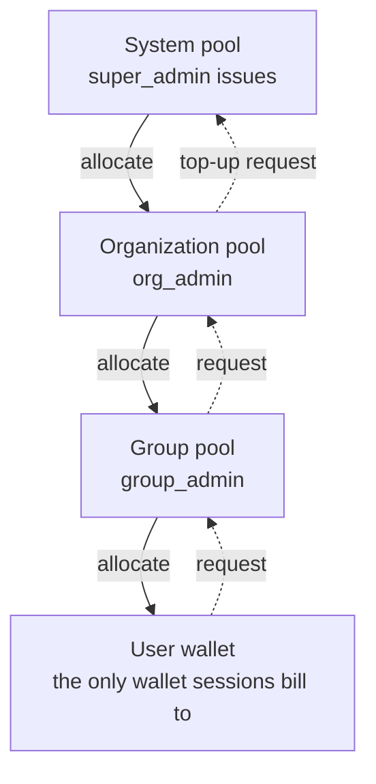

# Credits

Credits are how GPU time is rationed. They flow **down one level at a time** and no level can
hand out more than it holds.

| Page | What it covers |
|---|---|
| [Allocating](./credits-allocate.md) | Pools, handing credits down, reclaiming, monthly refills |
| [Requests](./credits-requests.md) | The request chain, approving and rejecting |
| [Settlement report](./credits-settlement.md) | What was actually consumed, per tenant |

## The hierarchy

Solid arrows are money moving; dashed arrows are **asking** for it. Nobody skips a level: a
group administrator cannot mint credits, and a user's session is billed **only to their own
personal wallet**.

| Tier | Who manages it | Can issue? |
|---|---|---|
| **System** | super_admin | Yes — this is where credits come into existence |
| **Organization** | org_admin | No; allocates what the system issued |
| **Group** | group_admin | No; allocates what the organization gave |
| **User** | the user | Spends only |

## What is billed

Only **GPU session time**: `rate × occupancy × runtime`, where the rate belongs to the
[offering](./resources-offerings.md) and occupancy is the larger of the VRAM and core
fractions. A session **holds** credits when it starts, consumes as it runs, and **settles**
when it ends, refunding the unused part.

CPU sessions, volumes, and queued sessions that never started cost nothing. They are bounded by
[resource policies](./resources-policies.md) instead — if someone is running too much *free*
work, the lever is quota, not credits.

## Where to start

- Your pools and the people under them: [Allocating](./credits-allocate.md).
- Someone is asking for more: [Requests](./credits-requests.md).
- "Where did the month go": [Settlement report](./credits-settlement.md), or the
  [audit log](./audit.md) for who changed what.
