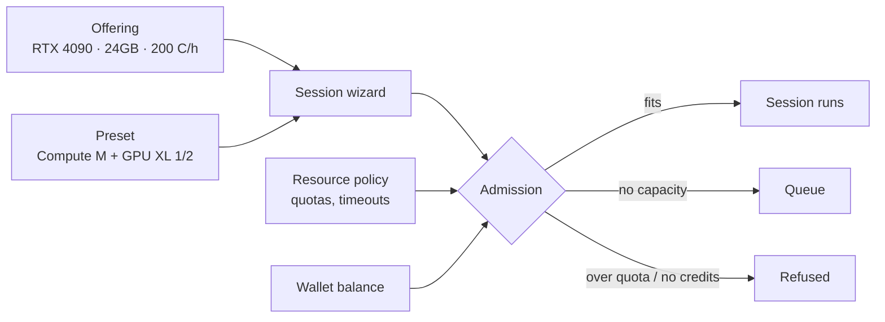

# Resources and policy

Two different things live under **Resources**, and mixing them up is the usual source of
confusion:

| | What it is | Page |
|---|---|---|
| **Catalogue** | What users may *choose* — GPU models and session sizes | [Offerings](./resources-offerings.md) · [Presets](./resources-presets.md) |
| **Policy** | What users may *hold* — quotas, timeouts, pool access | [Policies](./resources-policies.md) |

Both are super_admin territory, except policy requests, which a tenant administrator can see for
their own people.

## How they fit together

- An **offering** prices one GPU model.
- A **preset** is a ready-made size: compute shape plus a fraction of a card.
- A **policy** decides whether this user may hold that much at all.

A session is admitted only when the catalogue offers it, the policy allows it, and the wallet
covers it.

## The order to set things up

1. **Offerings** for every GPU model in the fleet — without one, cards are visible but unusable
   (`unserviceable`).
2. **Presets** so users pick sizes rather than raw numbers.
3. **Policies** for the global default, then per organization, group, or user where they differ.
4. **[Images](./images.md)** compatible with those GPUs.
