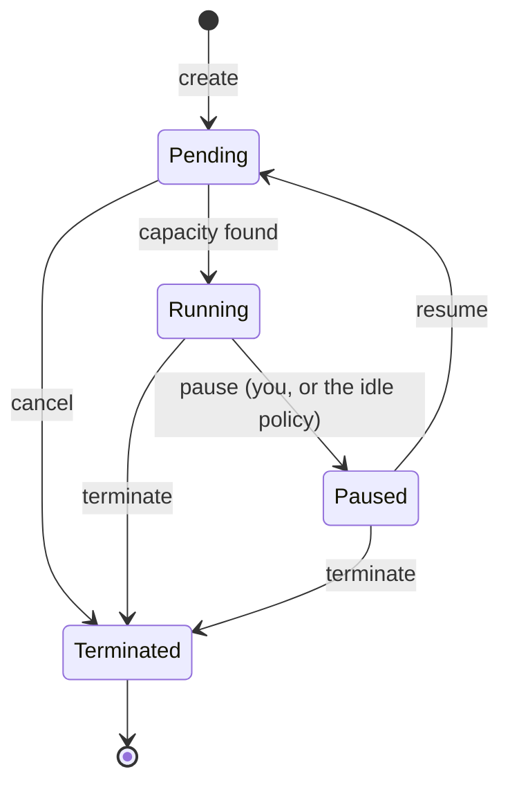

# Sessions

A **session** is your working environment: one container with a GPU slice (or a CPU-only
allocation), an image, and optionally your volumes mounted into it. You open it in the browser
with VS Code, JupyterLab, or a terminal — there is no SSH and nothing to install locally.

This section walks through the whole life of a session:

| Page | What it covers |
|---|---|
| [Creating a session](./sessions-create.md) | The five-step wizard: compute, GPU, image, volumes, review |
| [Connecting](./sessions-connect.md) | VS Code, JupyterLab, the web terminal, and the single-use links |
| [Managing a session](./sessions-manage.md) | Pause, resume, restart, live usage, the event log |
| [Waiting in the queue](./sessions-queue.md) | Why a session waits, where it stands, how to cancel |
| [Ending a session](./sessions-end.md) | Terminating one or many, what is billed, what survives |

## The session list

Only your own sessions are listed. Each row carries the state, the resources it holds, the
sharing mode, GPU occupancy, uptime, and what it has cost so far.

The tabs split the list by state — **Active** (running, paused, waiting), **Running**,
**Terminated**, and **All** — and the toolbar narrows it further by name or id, resource class,
and GPU model. All of it lives in the address bar, so a filtered view survives a reload and can
be pasted to someone else.

## States

| State | What it means | Billing |
|---|---|---|
| **Pending** | Waiting for capacity, or the container is starting | Credits are held, nothing is consumed |
| **Running** | The container is up and reachable | Billed per second at rate × occupancy |
| **Paused** | The container is gone, the GPU is returned, the session and its volumes are kept | Not billed |
| **Terminated** | Finished; the bill is settled and the unused hold refunded | Nothing further |
| **Error** | Refused or failed to start — the reason is on the detail page | Any hold is released |

Only **GPU** sessions consume credits. CPU sessions are free and are bounded by your
[resource policy](../admin/resources.md) instead.

## The detail page

Everything about one session in a single screen: the resources it holds, where it runs, the
image and volumes behind it, live usage, and the event log. The controls in the top-right are
covered in [Managing a session](./sessions-manage.md).
