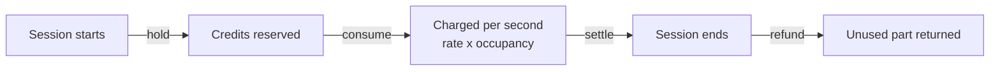

# Wallet and credits

Every user has a **personal wallet**. GPU session time is billed from it — and only from it: a
session can never be charged to someone else's wallet or to a group.

| Page | What it covers |
|---|---|
| [Transaction history](./wallet-ledger.md) | Every movement: holds, consumption, settlement, refunds |
| [Requesting credits](./wallet-request.md) | Asking your group for more, and what happens next |

## The four figures

| Tile | Meaning |
|---|---|
| **Balance** | Everything in the wallet, including what is currently held |
| **Burn rate** | Credits per hour your running GPU sessions consume, and how long the balance lasts at that rate |
| **Held** | Reserved by running sessions and not yet settled |
| **Available** | Balance − held. This is what a new session is admitted against |

A session is refused when **available** does not cover the hold it needs — even if the balance
looks healthy, because the rest is already promised to sessions that are running.

## How billing works

1. **Hold** — when a GPU session starts, an amount covering its expected runtime is reserved.
   It leaves *available* but not *balance*.
2. **Consume** — while it runs, the session is charged **rate × occupancy × time**. The rate
   belongs to the GPU model; occupancy is the share of the card you hold (VRAM or cores,
   whichever is larger). An eighth of a card costs an eighth of the rate.
3. **Settle** — when the session ends, the actual charge is finalised and **the unused part of
   the hold is refunded**.

What is **not** billed: CPU sessions, volumes, queued sessions that never ran, and paused
sessions. A balance never falls while no GPU session is running.

## Spending over time

The chart totals consumption per day over the last 7, 30, or 90 days, with the daily maximum
called out. It answers "where did this month go" faster than the ledger does.

Below it, **Billing now** lists the sessions charging right now with what they have consumed so
far — the live version of the burn rate, per session.

## Monthly refill

Your administrators may set a **monthly refill**: at the start of each month the wallet is
topped up to that amount without a request. The [ledger](./wallet-ledger.md) shows it as an
allocation like any other.
