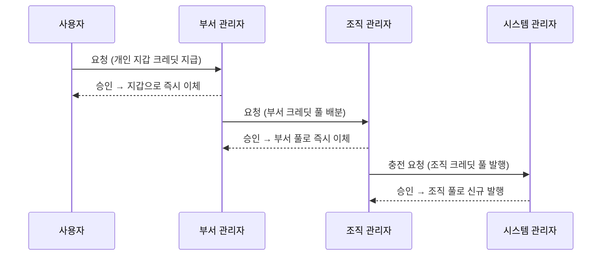

# 크레딧 요청 관리

크레딧 요청 관리는 크레딧이 부족한 계층(사용자, 부서, 조직)이 상위 관리자 계층으로 추가 배분 또는 충전을 신청하는 체계입니다. 콘솔의 **크레딧 관리 → 요청 관리** 메뉴는 수신된 요청을 검토·승인하는 수신함과 상위 계층으로 요청을 전달하는 신청 폼을 함께 제공합니다.

요청 및 승인은 계층 구조(사용자 → 부서 관리자 → 조직 관리자 → 시스템 관리자)를 엄격히 준수합니다. 어느 단계든 승인이 완료되면 크레딧이 **즉시 이동**하며, 별도의 2차 승인 절차는 진행하지 않습니다.

---

## 수신함

**들어온 요청** 탭에는 관리자 본인에게 전달된 검토 대기 항목만 표시됩니다.

| 테이블 항목 | 내용 및 설명 |
|---|---|
| **요청** | 요청 방향 (*개인 → 부서*, *부서 → 조직*, *조직 → 시스템*) |
| **대상** | 크레딧이 최종 지급/배분될 대상 지갑 또는 크레딧 풀 |
| **금액** | 요청된 크레딧 수량 |
| **요청자** | 요청을 제출한 계정 정보 |
| **사유** | 요청자가 작성한 사유 (승인/반려 판정의 주요 근거) |
| **요청 시각** | 크레딧 요청 등록 일시 |

* **승인**: 관리자의 가용 크레딧 풀에서 대상 지갑으로 금액을 **즉시 이체**하고 요청자에게 통보합니다.
* **반려**: 반려 사유를 입력하며, 해당 사유는 요청자에게 전달됩니다.
* **감사 및 취소**: 승인 및 반려 내역은 모두 [감사 로그](./audit.md)에 기록되며 취소할 수 없습니다. 잘못 승인한 경우 승인 취소가 아닌 [크레딧 회수](./credits-allocate.md) 기능을 통해 잔액을 되돌려야 합니다.
* **잔액 부족**: 관리자 풀 잔액이 요청 금액보다 적으면 승인이 실패합니다. 상위 계층에 먼저 크레딧을 요청하여 풀을 충전한 후 승인을 진행하세요.

---

## 상위 계층으로 크레딧 요청

수신함 상단 카드를 사용해 상위 관리자 계층으로 크레딧 배분 및 충전을 신청합니다.

* **부서 관리자**: 조직 관리자에게 부서 크레딧 풀로의 배분을 요청합니다.
* **조직 관리자**: 시스템 관리자에게 조직 풀 **충전(발행) 요청**을 제출합니다.
* **시스템 관리자**: 최상위 권한자이므로 해당 카드가 제공되지 않으며, [배분 탭](./credits-allocate.md#플랫폼-관리자-platform-admin)에서 직접 발행합니다.

---

## 요청 내역

수신함 하단의 **요청 내역** 목록에서는 과거에 처리된 모든 요청의 결과, 처리자 정보, 승인/반려 사유를 통합 조회 및 검토할 수 있습니다.

---

## 자원 증액 요청과의 구별

단순 크레딧 부족이 아닌 자원 쿼터(동시 실행 세션, CPU/GPU 한도, 스토리지 용량 등) 제한에 도달한 경우 **자원 증액 요청**을 별도로 신청해야 합니다. 해당 요청은 **자원 → 자원 정책 → 요청** 메뉴에서 처리됩니다.

| 거부 및 제약 사유 | 담당 처리 대기열 및 메뉴 |
|---|---|
| **크레딧 잔액 부족** | 크레딧 요청 관리 (**본 문서**) |
| **자원 쿼터 초과** (동시 실행, CPU/GPU, 스토리지 한도) | **[자원 증액 요청](./resources-policies.md#자원-증액-요청)** |
| **GPU 클러스터 여유 용량 고갈** | 대기열 처리 대상 아님 (플릿 전체 자원 부족) |