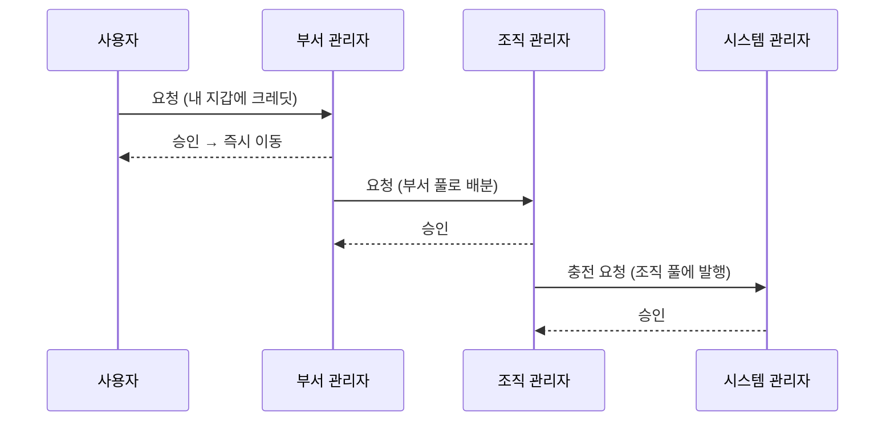

# 크레딧 요청 관리

예산은 밀어주기만 하는 것이 아니라 당겨오기도 합니다. 부족한 쪽이 한 단계 위에 요청합니다.
**크레딧 관리 → 요청 관리**는 내 수신함이자 내 요청 폼입니다.

화살표 하나가 한 단계입니다. 사용자가 시스템 관리자에게 직접 요청하는 일은 없고, 어느 단계든
승인하면 돈이 **즉시** 움직입니다. 2차 확인 단계는 없습니다.

## 수신함

**들어온 요청**은 *나에게* 온 것만 보여 줍니다.

| 열 | 의미 |
|---|---|
| **요청** | 방향 — *개인→부서*, *부서→조직*, *조직→시스템* |
| **대상** | 크레딧이 들어갈 지갑 |
| **금액** | 요청 금액 |
| **요청자** | 누가 요청했는지 |
| **사유** | 본인의 말. 이것이 요청의 근거 전부입니다 |
| **요청 시각** | 언제 |

**승인**은 내 풀에서 대상 지갑으로 크레딧을 **즉시** 옮기고 요청자에게 알립니다. **반려**는 사유를
묻고, 그 사유는 요청자에게 보입니다. 둘 다 [감사 로그](./audit.md)에 남고 되돌릴 수 없습니다.
잘못 승인했다면 취소가 아니라 회수로 되돌립니다.

내 풀에 금액이 남아 있지 않으면 승인이 실패합니다. 먼저 내 풀을 채우거나(위 단계에 요청) 나서
승인하세요.

## 한 단계 위에 요청하기

같은 탭 위쪽 카드가 한 단계 위를 향한 내 요청 폼입니다.

- **부서 관리자**는 조직에 부서 풀로의 배분을 요청합니다.
- **조직 관리자**는 조직 지갑에 **충전 요청**을 올리고, 이는 시스템 관리자만 승인할 수 있습니다.
- **시스템 관리자**에게는 이 카드가 없습니다.
  [배분 탭](./credits-allocate.md#플랫폼-관리자로서)에서 직접 발행합니다.

## 요청 내역

수신함 아래 **요청 내역**은 처리된 모든 요청을 결과·처리자와 함께 보관합니다. 누군가 3월에 요청했다고
할 때, 행과 사유와 결정이 모두 거기 있습니다.

## 자원 증액은 다른 대기열

크레딧이 아니라 **쿼터**에 막힌 사용자는
[자원 증액 요청](./resources-policies.md#자원-증액-요청)을 올립니다. 그것은 여기가 아니라
**자원 → 자원 정책 → 요청**으로 갑니다. 기준은 이렇습니다.

| 사용자가 막힌 이유 | 대기열 |
|---|---|
| *크레딧 부족* | 크레딧 요청(이 페이지) |
| *쿼터 초과*, 동시 실행, 스토리지 | [자원 요청](./resources-policies.md#자원-증액-요청) |
| *GPU 여유 용량 부족* | 둘 다 아님 — 플릿이 꽉 참 |
