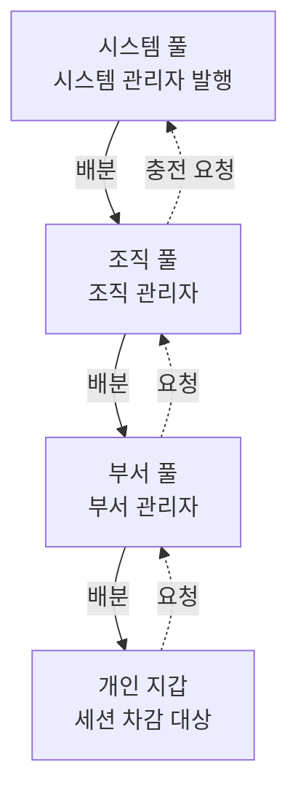

# 크레딧 관리 개요

gShare의 크레딧은 GPU 자원 사용 시간을 제어하고 배분하는 단위입니다. 크레딧은 최상위 계층부터 최하위 계층까지 **단계를 건너뛰지 않고 순차적으로 배분**되며, 각 계층 관리자는 자신이 보유한 크레딧 풀(Pool)의 가용 잔액 범주 내에서만 하위 계층으로 크레딧을 할당할 수 있습니다.

| 연관 메뉴 / 문서 | 주요 기능 및 내용 |
|---|---|
| **[크레딧 배분](./credits-allocate.md)** | 계층별 크레딧 풀 관리, 하위 배분, 회수(Reclaim), 월 자동 리필 설정 |
| **[크레딧 요청 관리](./credits-requests.md)** | 계층별 크레딧 요청 체인, 승인 및 반려 처리 |
| **[정산 리포트](./credits-settlement.md)** | 기간별/테넌트별 실제 크레딧 소모량 및 GPU 가동 시간 집계 |

---

## 크레딧 계층 구조

* **실선 (배분 흐름)**: 상위 크레딧 풀에서 하위 풀/지갑으로 크레딧이 순차 이체됩니다.
* **점선 (요청 흐름)**: 하위 계층에서 상위 계층으로 크레딧 배분 및 충전을 요청합니다.

| 계층 단계 | 관리 주체 | 신규 발행(Mint) 권한 | 비고 |
|---|---|---|---|
| **시스템** | 시스템 관리자 | **가능** | 플랫폼 전체 크레딧이 최초 생성되는 최상위 풀 |
| **조직** | 조직 관리자 | 불가 | 시스템 풀에서 배분받은 크레딧을 하위 부서에 할당 |
| **부서** | 부서 관리자 | 불가 | 조직 풀에서 배분받은 크레딧을 소속 개인에게 할당 |
| **개인** | 사용자 본인 | 불가 | 세션 실행 시 크레딧이 실제로 차감 청구되는 유일한 지갑 |

---

## 과금 대상 및 산정 방식

gShare에서는 **실행 중인 GPU 세션 시간**에 대해서만 크레딧이 과금됩니다.

$$\text{과금 크레딧} = \text{오퍼링 단가} \times \text{자원 점유율} \times \text{실행 시간}$$

* **오퍼링 단가**: 세션 생성 시 선택한 [오퍼링(Offering)](./resources-offerings.md)에 설정된 크레딧 단가
* **자원 점유율**: 해당 세션이 점유하는 VRAM 비율과 GPU 코어 비율 중 더 높은 비율 적용
* **세션 정산 프로세스**: 세션 시작 시 예상 비용이 사전 **예약(Reserved)**되고, 세션이 실행되는 동안 지속 소모되며, 세션 종료 시 미사용 예약분이 정산되어 개인 지갑으로 환불됩니다.

> **과금 제외 대상**: CPU 전용 세션, 볼륨 스토리지, 실행 상태로 전환되지 않은 대기(Pending) 세션은 크레딧을 소모하지 않습니다. 이러한 자원들의 과도한 점유는 [자원 정책](./resources-policies.md)의 쿼터(Quota) 설정을 통해 제어됩니다.

---

## 작업별 바로가기

* **크레딧 풀 및 개인 잔액 관리**: **[크레딧 배분](./credits-allocate.md)**
* **수신된 크레딧 요청 검토/승인**: **[크레딧 요청 관리](./credits-requests.md)**
* **기간별 크레딧 소모 및 사용량 분석**: **[정산 리포트](./credits-settlement.md)**
* **크레딧 배분 및 정책 변경 추적**: **[감사 로그](./audit.md)**