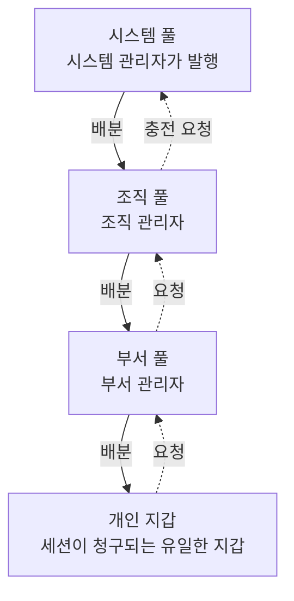

# 크레딧

크레딧은 GPU 시간을 배급하는 수단입니다. **한 번에 한 단계씩** 아래로 흐르고, 어느 단계도 자기가
가진 것보다 많이 나눠 줄 수 없습니다.

| 페이지 | 내용 |
|---|---|
| [배분하기](./credits-allocate.md) | 풀, 아래로 내려주기, 회수, 월 리필 |
| [요청 관리](./credits-requests.md) | 요청 체인, 승인과 반려 |
| [정산 리포트](./credits-settlement.md) | 테넌트별로 실제 소비된 양 |

## 계층

실선은 돈이 움직이는 것이고 점선은 **요청**입니다. 아무도 단계를 건너뛰지 않습니다. 부서 관리자는
크레딧을 발행할 수 없고, 사용자의 세션은 **본인 개인 지갑에만** 청구됩니다.

| 단계 | 관리자 | 발행 가능? |
|---|---|---|
| **시스템** | 시스템 관리자 | 가능 — 크레딧이 생겨나는 곳 |
| **조직** | 조직 관리자 | 불가. 시스템이 발행한 것을 배분 |
| **부서** | 부서 관리자 | 불가. 조직이 준 것을 배분 |
| **개인** | 본인 | 소비만 |

## 무엇이 과금되나

**GPU 세션 시간만**입니다. `단가 × 점유율 × 실행 시간`이고, 단가는
[오퍼링](./resources-offerings.md)의 것, 점유율은 VRAM과 코어 중 큰 비율입니다. 세션은 시작할 때
**예약**하고, 실행하며 소비하고, 끝날 때 **정산**해 미사용분을 환불합니다.

CPU 세션, 볼륨, 한 번도 시작되지 않은 대기 세션은 비용이 없습니다. 대신
[자원 정책](./resources-policies.md)으로 제한됩니다. 누군가 *무료* 작업을 지나치게 돌리고 있다면
지렛대는 크레딧이 아니라 쿼터입니다.

## 어디서 시작할까

- 내 풀과 그 아래 사람들: [배분하기](./credits-allocate.md)
- 누군가 더 달라고 할 때: [요청 관리](./credits-requests.md)
- "이번 달 어디로 갔지": [정산 리포트](./credits-settlement.md), 또는 누가 무엇을 바꿨는지는
  [감사 로그](./audit.md)
