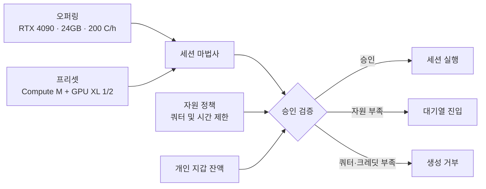

# 자원 및 정책 개요

콘솔의 **자원** 메뉴 하위 영역은 카탈로그(사용자가 선택 가능한 자원)와 정책(사용자가 점유 가능한 자원 한도)이라는 성격이 다른 두 축으로 구성됩니다.

| 분류 | 정의 및 역할 | 관련 메뉴 / 문서 |
|---|---|---|
| **카탈로그 (Catalog)** | 사용자가 세션 생성 시 선택할 수 있는 자원 옵션 (GPU 모델 및 세션 크기 규격) | **[오퍼링](./resources-offerings.md)** · **[프리셋](./resources-presets.md)** |
| **정책 (Policy)** | 사용자가 할당 및 점유할 수 있는 최대 자원 한도 (쿼터, 시간 제한, 노드 풀 접근 권한 등) | **[자원 정책](./resources-policies.md)** |

> **권한 범위**: 카탈로그 및 자원 정책의 등록·수정은 최고 시스템 관리자(Platform Admin) 권한으로 수행됩니다. 단, 소속 구성원이 제출한 자원 증액 요청 검토 및 처리는 테넌트 관리자(조직/부서 관리자)도 수행할 수 있습니다.

---

## 자원 승인 및 검증 메커니즘

* **오퍼링 (Offering)**: 특정 GPU 모델의 자원 스펙 및 시간당 소모 크레딧 단가 정의
* **프리셋 (Preset)**: 표준화된 세션 연산 규격 (컴퓨트 스펙 및 GPU 자원 분할 비율)
* **자원 정책 (Policy)**: 계층별(사용자/부서/조직) 최대 자원 사용 한도(Quota) 및 제약 조건 설정

신규 세션 생성 요청은 **카탈로그에서 제공하는 오퍼링/프리셋 항목**을 기반으로 작성되며, **설정된 자원 정책 한도를 초과하지 않고**, **개인 지갑에 충분한 크레딧 잔액이 존재**할 때에만 최종 승인되어 프로비저닝됩니다.

---

## 초기 자원 구성 및 설정 순서

1. **[오퍼링(Offering) 등록](./resources-offerings.md)**: 데이터 플레인 플릿에 탑재된 모든 GPU 디바이스 모델에 대한 오퍼링 카탈로그를 생성합니다. (오퍼링이 등록되지 않은 GPU 카드는 인프라상에 존재하더라도 `unserviceable` 오류가 발생하며 세션 생성에 사용할 수 없습니다.)
2. **[프리셋(Preset) 설정](./resources-presets.md)**: 사용자가 복잡한 자원 수치를 직접 계산하지 않고 선택할 수 있도록 컴퓨트 프리셋 및 GPU 티어를 세팅합니다.
3. **[자원 정책(Policy) 수립](./resources-policies.md)**: 플랫폼전역 기본 정책(Default Policy)을 수립한 후, 특정 조직·부서·사용자에 적용할 맞춤형 차등 정책을 설정합니다.
4. **[배포 이미지(Image) 등록](./images.md)**: 오퍼링의 GPU 하드웨어 및 CUDA 드라이버 버전과 호환되는 워크로드 실행용 이미지를 등록합니다.