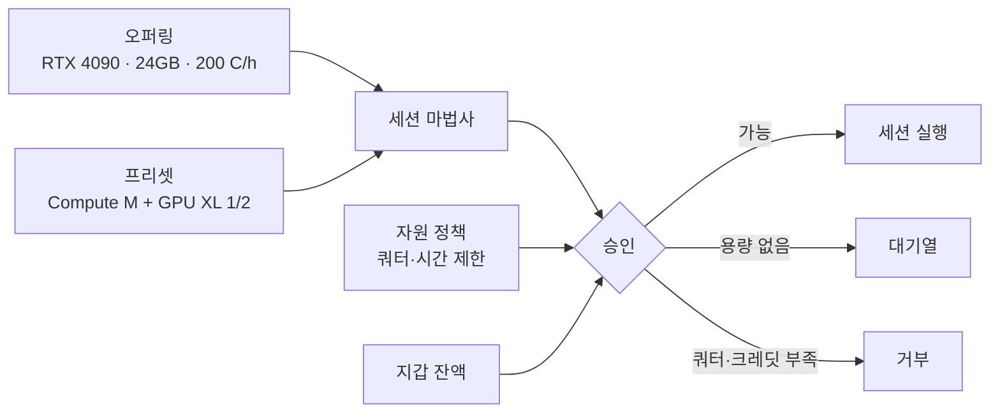

# 자원과 정책

**자원** 아래에는 성격이 다른 두 가지가 있고, 이 둘을 섞는 것이 흔한 혼란의 원인입니다.

| | 무엇인가 | 페이지 |
|---|---|---|
| **카탈로그** | 사용자가 *고를 수 있는 것* — GPU 모델과 세션 크기 | [오퍼링](./resources-offerings.md) · [프리셋](./resources-presets.md) |
| **정책** | 사용자가 *쥘 수 있는 양* — 쿼터, 시간 제한, 풀 권한 | [자원 정책](./resources-policies.md) |

둘 다 시스템 관리자 영역입니다. 예외는 정책 요청으로, 테넌트 관리자도 자기 사람들 것은 볼 수
있습니다.

## 어떻게 맞물리나

- **오퍼링**은 GPU 모델 하나의 가격을 정합니다.
- **프리셋**은 미리 만들어 둔 크기입니다. 컴퓨트 형태와 카드의 몇 분의 몇.
- **정책**은 이 사용자가 그만큼 쥘 수 있는지를 정합니다.

세션은 카탈로그가 제공하고, 정책이 허용하고, 지갑이 감당할 때만 승인됩니다.

## 설정 순서

1. 플릿의 모든 GPU 모델에 **오퍼링**. 없으면 카드는 보이지만 쓸 수 없습니다(`unserviceable`).
2. 사용자가 숫자 대신 크기를 고르도록 **프리셋**.
3. 전역 기본 **정책**, 그다음 다른 값이 필요한 조직·부서·사용자별 정책.
4. 그 GPU와 호환되는 **[이미지](./images.md)**.
