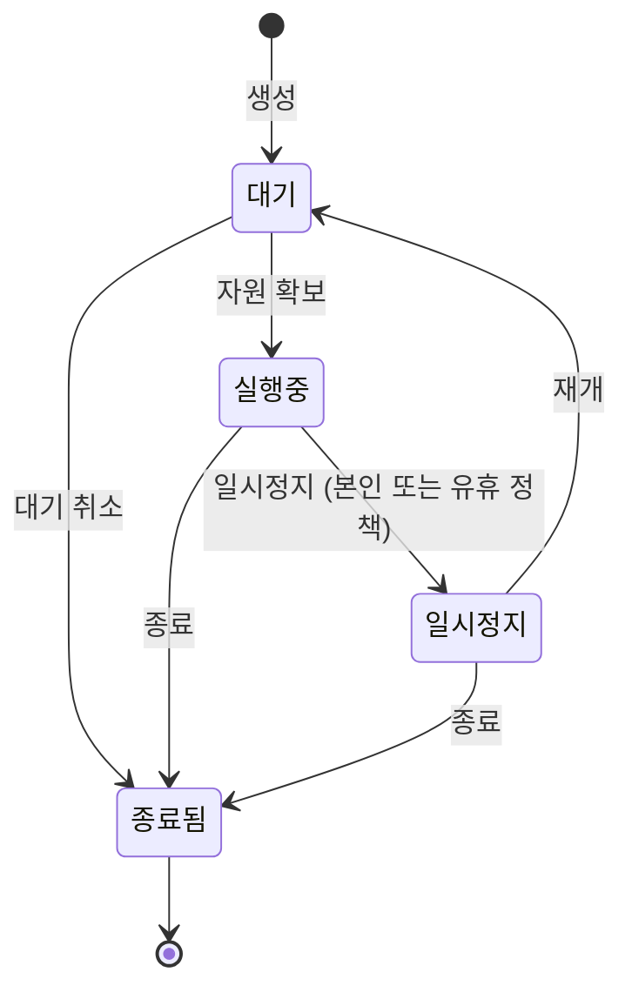

# 세션

**세션**은 작업 환경입니다. GPU 조각(또는 CPU 전용 할당), 이미지, 그리고 선택적으로 마운트한
볼륨을 가진 컨테이너 하나입니다. 브라우저에서 VS Code, JupyterLab, 터미널로 엽니다. SSH도, 로컬에
설치할 것도 없습니다.

이 장은 세션의 한살이를 따라갑니다.

| 페이지 | 내용 |
|---|---|
| [세션 만들기](./sessions-create.md) | 5단계 마법사: 컴퓨트, GPU, 이미지, 볼륨, 확인 |
| [접속하기](./sessions-connect.md) | VS Code, JupyterLab, 웹 터미널과 일회용 링크 |
| [세션 관리](./sessions-manage.md) | 일시정지·재개·재시작, 실시간 사용량, 이벤트 로그 |
| [대기열에서 기다리기](./sessions-queue.md) | 왜 기다리는지, 몇 번째인지, 취소하는 법 |
| [세션 종료](./sessions-end.md) | 하나 또는 여러 개 종료, 과금, 남는 것과 사라지는 것 |

## 세션 목록

내 세션만 나열됩니다. 각 행에 상태, 점유한 자원, 공유 방식, GPU 점유율, 가동 시간, 지금까지의
비용이 있습니다.

탭은 상태로 나눕니다 — **활성**(실행·일시정지·대기), **실행중**, **종료**, **전체**. 툴바는 이름·ID,
자원 클래스, GPU 모델로 더 좁힙니다. 모두 주소창에 담기므로 새로고침해도 유지되고 그대로 공유할 수
있습니다.

## 상태

| 상태 | 뜻 | 과금 |
|---|---|---|
| **대기(pending)** | 자원을 기다리거나 컨테이너가 시작되는 중 | 크레딧은 예약만, 소비 없음 |
| **실행중(running)** | 컨테이너가 떠 있고 접속 가능 | 단가 × 점유율로 초 단위 과금 |
| **일시정지(paused)** | 컨테이너가 사라지고 GPU는 반환, 세션과 볼륨은 유지 | 과금 없음 |
| **종료됨(terminated)** | 끝남. 정산되고 미사용 예약은 환불 | 이후 없음 |
| **오류(error)** | 거부되었거나 시작에 실패 — 사유는 상세 페이지에 | 예약은 해제됨 |

크레딧을 쓰는 것은 **GPU 세션뿐**입니다. CPU 세션은 무료이며 대신
[자원 정책](../admin/resources.md)으로 제한됩니다.

## 상세 페이지

한 세션의 모든 것이 한 화면에 있습니다. 점유한 자원, 실행 위치, 바탕이 된 이미지와 볼륨, 실시간
사용량, 이벤트 로그. 오른쪽 위 버튼은 [세션 관리](./sessions-manage.md)에서 다룹니다.
