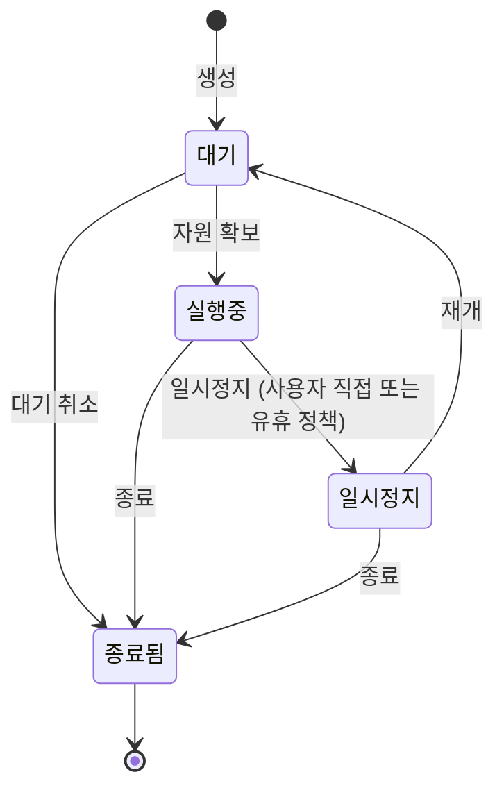

# 세션

**세션**은 컨테이너 기반의 작업 환경입니다. 할당된 GPU 자원(또는 CPU 자원), 이미지, 마운트된 영구 볼륨으로 구성되며, 별도의 SSH 설정이나 로컬 클라이언트 설치 없이 브라우저에서 VS Code, JupyterLab, 웹 터미널을 이용해 즉시 접속할 수 있습니다.

이 문서에서는 세션 생성부터 접속, 관리, 대기열, 종료까지 세션의 전체 생애주기를 안내합니다.

| 페이지 | 설명 |
|---|---|
| [세션 만들기](./sessions-create.md) | 5단계 마법사 안내 (컴퓨트, GPU, 이미지, 볼륨, 최종 확인) |
| [접속하기](./sessions-connect.md) | code-server(VS Code), JupyterLab, ttyd(웹 터미널) 접속 및 일회용 링크 관리 |
| [세션 관리](./sessions-manage.md) | 일시정지·재개·재시작, 실시간 리소스 모니터링, 이벤트 로그 확인 |
| [대기열에서 기다리기](./sessions-queue.md) | 자원 대기열 메커니즘, 대기 순번 및 취소 방법 |
| [세션 종료](./sessions-end.md) | 단일/일괄 종료, 크레딧 정산 및 데이터 보존 범위 |

## 세션 목록

내 세션 목록 화면에서는 사용자가 생성한 세션 목록을 확인할 수 있습니다. 각 세션별로 상태, 할당된 자원, 공유 방식(전용/분할), GPU 점유율, 가동 시간, 누적 소모 크레딧이 표시됩니다.

상단 탭을 통해 상태별 세션을 구분하여 조회할 수 있습니다 (**활성**(실행/일시정지/대기), **실행중**, **종료**, **전체**). 검색 툴바 필터를 사용하여 세션 이름/ID, 자원 클래스, GPU 모델별로 검색 결과를 필터링할 수 있습니다. 필터 설정값은 URL 주소에 반영되므로 페이지를 새로고침하거나 URL을 공유해도 동일한 필터 상태가 유지됩니다.

## 세션 상태 및 전환 흐름

| 상태 | 설명 | 과금 여부 |
|---|---|---|
| **대기 (Pending)** | 자원 할당 대기 또는 컨테이너 생성 중인 상태 | 크레딧 선예약 상태 (실제 과금 미발생) |
| **실행 중 (Running)** | 컨테이너 생성 완료 및 접속 가능 상태 | `기본 단가 × 점유율` 기준 초 단위 차감 |
| **일시정지 (Paused)** | 컨테이너 중지 및 GPU 반납 상태 (세션 설정 및 볼륨 보존) | 크레딧 차감 중단 (과금 없음) |
| **종료됨 (Terminated)** | 세션 종료 및 자원 반납 완료 (최종 크레딧 정산) | 추가 과금 없음 (선예약 잔액 환불) |
| **오류 (Error)** | 자원 생성 실패 또는 오류 발생 상태 (상세 페이지에서 원인 확인) | 선예약 크레딧 즉시 해제 |

크레딧 차감은 **GPU 세션**에만 적용됩니다. CPU 세션은 무료로 제공되며, 계정별 [자원 정책](../admin/resources.md)상의 동시 실행 수량 제한을 받습니다.

## 세션 상세 페이지

개별 세션 상세 페이지에서는 세션의 전체 운영 정보를 통합 조회할 수 있습니다. 할당된 자원 스펙, 실행 클러스터/노드 위치, 적용된 컨테이너 이미지 및 마운트된 볼륨, 실시간 리소스 사용량, 시계열 이벤트 로그를 한눈에 확인할 수 있습니다. 우측 상단의 관리 버튼을 통한 제어 방법은 [세션 관리](./sessions-manage.md) 안내를 참고하세요.