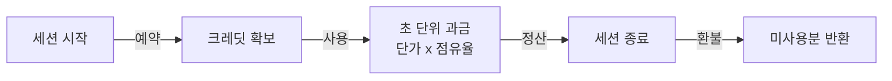

# 지갑과 크레딧

모든 사용자는 **개인 지갑**을 가집니다. GPU 세션 시간은 이 지갑에서만 과금됩니다. 세션이 다른
사람의 지갑이나 부서에 청구되는 일은 없습니다.

| 페이지 | 내용 |
|---|---|
| [거래 내역](./wallet-ledger.md) | 예약·사용·정산·환불 모든 이동 |
| [크레딧 요청](./wallet-request.md) | 부서에 요청하기, 그 뒤의 절차 |

## 네 개의 수치

| 타일 | 의미 |
|---|---|
| **잔액** | 지금 예약된 금액까지 포함한 지갑 전체 |
| **소진 속도** | 실행 중인 GPU 세션이 시간당 소비하는 크레딧과, 이 속도로 잔액이 버티는 시간 |
| **예약** | 실행 중 세션이 잡아 두었고 아직 정산되지 않은 금액 |
| **가용** | 잔액 − 예약. 새 세션은 이 값으로 승인됩니다 |

**가용**이 필요한 예약을 감당하지 못하면 세션은 거부됩니다. 잔액이 넉넉해 보여도 나머지는 이미
실행 중인 세션에 약속된 돈이기 때문입니다.

## 과금 방식

1. **예약(hold)** — GPU 세션이 시작될 때 예상 실행 시간만큼의 금액이 확보됩니다. *가용*에서는
   빠지지만 *잔액*에서는 빠지지 않습니다.
2. **사용(consume)** — 실행되는 동안 **단가 × 점유율 × 시간**으로 과금됩니다. 단가는 GPU 모델의
   것이고, 점유율은 카드에서 차지한 비율(VRAM 또는 코어 중 큰 쪽)입니다. 카드의 ⅛이면 단가의
   ⅛입니다.
3. **정산(settle)** — 세션이 끝나면 실제 금액이 확정되고 **예약의 미사용분은 환불**됩니다.

과금되지 **않는** 것: CPU 세션, 볼륨, 한 번도 실행되지 않은 대기 세션, 일시정지된 세션. GPU 세션이
없으면 잔액은 줄지 않습니다.

## 기간별 소모

최근 30일, 특정 월, 또는 직접 지정한 기간의 일별 소비 합계를 그리고, 일 최대치를 함께 표시합니다. "이번 달 어디에 썼지"를
거래 내역보다 빠르게 답해 줍니다.

그 아래 **현재 과금 중**은 지금 과금되고 있는 세션과 지금까지의 사용 금액을 보여 줍니다. 소진
속도를 세션별로 풀어 놓은 것입니다.

## 월 리필

관리자가 **월 리필**을 설정해 두었다면 매달 초 요청 없이 그 금액까지 지갑이 채워집니다.
[거래 내역](./wallet-ledger.md)에는 다른 배분과 똑같이 나타납니다.
