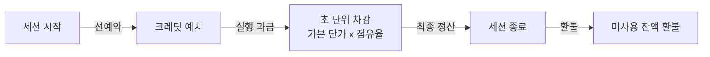

# 지갑과 크레딧

모든 사용자는 계정별 **개인 지갑**을 보유합니다. GPU 세션 이용에 따른 크레딧은 이 개인 지갑에서만 차감되며, 다른 사용자나 부서 지갑으로 이중 청구되지 않습니다.

| 페이지 | 설명 |
|---|---|
| [거래 내역](./wallet-ledger.md) | 크레딧 선예약·차감·정산·환불 등 전체 변동 이력 |
| [크레딧 요청](./wallet-request.md) | 부서 관리자 대상 크레딧 신청 및 승인 절차 |

## 주요 잔액 및 사용 지표

| 지표 항목 | 설명 |
|---|---|
| **잔액** | 현재 보유 중인 총 크레딧 (선예약 금액 포함) |
| **소진 속도** | 실행 중인 GPU 세션의 시간당 크레딧 소비율 및 잔액 기준 예상 소진 시간 |
| **예약** | 실행 중인 세션에 선예약(Hold)되어 아직 최종 정산되지 않은 금액 |
| **가용** | 실제 사용 가능한 잔액 (`잔액 − 예약`). 신규 세션 생성 시 가용 잔액을 기준으로 승인 여부가 결정됩니다. |

신규 세션 생성 시 필요한 선예약 금액이 **가용 잔액**을 초과하면 세션 생성이 거부됩니다. 총 잔액이 충분해 보이더라도 해당 금액이 기존 실행 중인 세션들에 이미 선예약된 상태일 수 있습니다.

## 과금 메커니즘

1. **예약 (Hold):** GPU 세션이 시작될 때 예상 실행 시간에 비례한 금액이 선예약됩니다. 가용 잔액에서는 즉시 차감되지만, 총 잔액에서는 아직 최종 차감되지 않은 상태로 유지됩니다.
2. **사용 (Consume):** 세션 실행 시간 동안 `기본 단가 × 점유율 × 실행 시간` 공식을 기반으로 초 단위 과금됩니다. 기본 단가는 선택한 GPU 모델 기준이며, 점유율은 GPU 자원(VRAM 또는 코어 중 높은 쪽)의 분할 점유 비율을 따릅니다 (예: GPU 자원의 1/8 점유 시 단가의 1/8 과금).
3. **정산 (Settle):** 세션이 종료되면 실제 실행 시간에 대한 크레딧이 확정 청구되고, **선예약 금액 중 미사용 잔액은 가용 잔액으로 즉시 환불**됩니다.

**과금 제외 대상:** CPU 전용 세션, 영구 볼륨, 대기열에 대기 중인 세션, 일시정지 상태의 세션은 크레딧이 과금되지 않습니다. 실행 중인 GPU 세션이 없다면 크레딧 잔액은 차감되지 않고 유지됩니다.

## 기간별 크레딧 소모 현황

최근 30일, 특정 월, 또는 지정한 기간 동안의 일별 크레딧 소모 추이 및 일일 최고 소비량을 차트로 조회할 수 있습니다. 일별 사용량을 직관적으로 파악하여 거래 내역을 세부 조회하기 전 전체 사용 흐름을 손쉽게 확인할 수 있습니다.

하단의 **현재 과금 중** 패널에서는 현재 크레딧이 차감되고 있는 세션 목록과 실시간 누적 소모 금액을 보여줍니다. 전체 크레딧 소진 속도를 개별 세션 단위로 세분화하여 확인할 수 있습니다.

## 월간 자동 충전 (Refill)

시스템 관리자가 **월간 자동 충전** 정책을 설정한 경우, 매월 초 별도의 신청 절차 없이 지정된 금액만큼 지갑에 크레딧이 자동으로 채워집니다. 해당 충전 내역은 [거래 내역](./wallet-ledger.md)에 동일하게 배분 항목으로 기록됩니다.